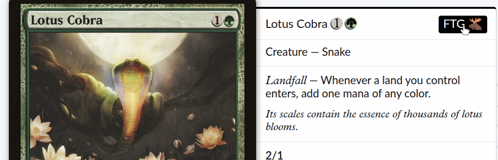
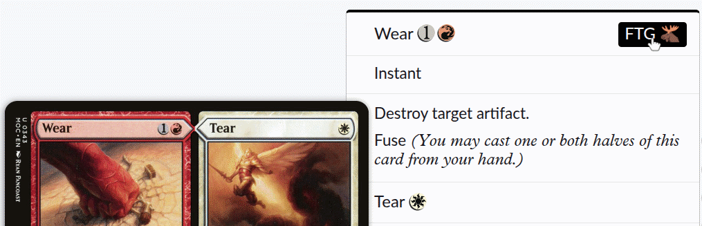

# Scryfall → FTG

A Chrome extension that adds a quick search button on Scryfall card pages to find that card on [First Turn Games](https://www.firstturngames.com).

## How it works

When viewing any card on Scryfall (e.g. `scryfall.com/card/...`), a **FTG 🫎** button appears in the card name header. Clicking it opens a First Turn Games product search for that card in a new tab.

Split, fuse, and double-faced cards (e.g. `Wear // Tear`) are handled automatically — all face names are joined and searched together.

## Installation

### From a release (recommended)

1. Download `scryfall-to-ftg.zip` from the [latest release](https://github.com/mrkhdly/scryfall-to-ftg/releases/latest)
2. Unzip it
3. Go to `chrome://extensions/`
4. Enable **Developer mode** (top right)
5. Click **Load unpacked** and select the unzipped folder

### From source

1. Clone or download this repo
2. Go to `chrome://extensions/`
3. Enable **Developer mode** (top right)
4. Click **Load unpacked** and select the repo folder

## Testing

Test URLs

| What it tests | Open on Scryfall |
|------|-----|
| Single-faced card | [Ancestral Recall](https://scryfall.com/card/lea/47/ancestral-recall) |
| Split card (Wear // Tear) | [Wear // Tear](https://scryfall.com/card/dgm/135/wear-tear) |
| Double-faced card | [Jace, Vryn's Prodigy](https://scryfall.com/card/ori/60/jace-vryns-prodigy-jace-telepath-unbound) |
| Phyrexian-script variant | [Phyrexian Obliterator](https://scryfall.com/card/one/105/phyrexian-obliterator) |
| Apostrophe in name | [Tamiyo, Collector of Tales](https://scryfall.com/card/war/220/tamiyo-collector-of-tales) |
| Foil/premium printings | [Rite of Flame](https://scryfall.com/card/csp/96/rite-of-flame) |
| Alternate art variant | [Ketria Triome](https://scryfall.com/card/iko/250/ketria-triome) |
| Comma in name | [Najeela, the Blade-Blossom](https://scryfall.com/card/bbd/62/najeela-the-blade-blossom) |
| Hyphen in name | [Brass-Talon Chimera](https://scryfall.com/card/vis/142/brass-talon-chimera) |
| Long card name (32 chars) | [Chains of Mephistopheles](https://scryfall.com/card/me1/63/chains-of-mephistopheles) |

## Privacy

This extension requests no user data and has no tracking of any kind. It only runs on `scryfall.com/card/*` pages, reads the card name from the page, and constructs a search URL for First Turn Games. No `scripting` permission is required or requested.

## License

Apache 2.0 — see [LICENSE](LICENSE)

Icon derived from [Noto Emoji](https://github.com/googlefonts/noto-emoji) by Google, licensed under Apache 2.0.
